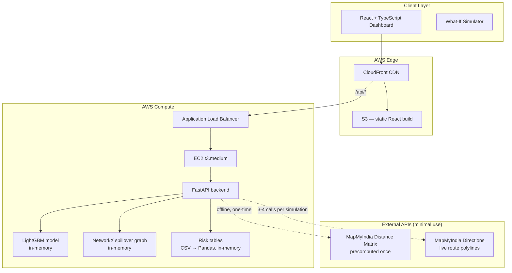

# 🚦 ASTRA — Autonomous Strategic Traffic Response Assistant

**An AI-powered decision-support system for Traffic Police**

*Built for Flipkart Grid 6.0 — Event-Driven Congestion (Planned & Unplanned)*


📄 Full formulas, data audits, and worked examples for every engine below live in [`DESIGN_SPEC.md`](DESIGN_SPEC.md) — this README is the judge-facing summary.

---

## 30-Second Pitch

> Every traffic event — a breakdown, a procession, a flooded road — is currently handled the same way: an officer looks at it, guesses how bad it is, and deploys resources from memory. **ASTRA replaces the guess.**
>
> Feed it an event (cause, location, time, road-closure status) and in under a second it tells you: how severe it is (0–100 score), how long it will likely last (ML-predicted), how far the congestion will spread (km), exactly which junctions will be hit and how badly, which corridors to divert traffic to, how many officers/barricades/patrol vehicles to deploy and *where*, and — critically — **what happened the last 14 times something like this occurred.**
>
> It is a **decision-support system**, not a black box. Every rule-based number is traceable to a formula derived from the dataset. The only machine-learned number is event duration, because it is the only one with a real label to train against.

---

## Table of Contents

1. [Problem Statement](#1-problem-statement)
2. [Solution Overview](#2-solution-overview)
3. [System Architecture](#3-system-architecture)
4. [The Dataset](#4-the-dataset)
5. [Machine Learning Pipeline](#5-machine-learning-pipeline)
6. [Rule-Based Decision Engines](#6-rule-based-decision-engines)
7. [Backend](#7-backend)
8. [Frontend](#8-frontend)
9. [Data Storage](#9-data-storage)
10. [API Reference](#10-api-reference)
11. [Project Structure](#11-project-structure)
12. [Local Setup](#12-local-setup)
13. [AWS Deployment](#13-aws-deployment)
14. [Build Roadmap](#14-build-roadmap)
15. [Current Implementation Status](#15-current-implementation-status)
16. [Honest Limitations](#16-honest-limitations)
17. [Future Scope](#17-future-scope)
18. [Team](#18-team)

---

## 1. Problem Statement

> "Event impact is not quantified in advance. Resource deployment is experience-driven. There is no post-event learning system."

Bangalore traffic police handle thousands of planned and unplanned events a year — breakdowns, accidents, processions, waterlogging, construction, VIP movements — using nothing but field experience. Three structural gaps drive the design of ASTRA:

| Gap in Current Practice | ASTRA's Answer |
|---|---|
| No way to quantify how bad an event will be before deploying resources | **Event Severity Index (ESI)** — a transparent 0–100 score |
| Resource deployment (officers, barricades, vehicles) is guessed from memory | **Resource Planner** — formula-driven officer/barricade/vehicle counts, per-junction |
| Nothing is learned from past events; every incident starts from zero | **Historical Memory Tables + Similar Event Engine** — every prediction is backed by real past incidents |

---

## 2. Solution Overview

ASTRA ingests a single event description and runs it through six engines in series, returning a complete decision package in **under 1 second**:


**Design principle — ML only where a real label exists.** The dataset has exactly one measurable outcome: `closed_datetime − start_datetime` (event duration). That is the only thing ASTRA predicts with machine learning. Severity, congestion spread, propagation, diversion scoring, and resourcing are **transparent rule-based formulas**, each derived from a measurable pattern in the data and documented with its own justification (see [Section 6](#6-rule-based-decision-engines)). A traffic officer can inspect, question, and override every number — nothing is a black box.

---

## 3. System Architecture



**Why no database.** The full historical dataset is 8,173 rows / 45 columns — well under 10 MB. It is loaded once into Pandas DataFrames at process start and held in memory for the lifetime of the backend. Adding Postgres/Mongo here would add latency, infra cost, and deployment complexity with zero benefit at this scale. See [Section 9](#9-data-storage) for what this would look like at production scale.

---

## 4. The Dataset

8,173 historical traffic incidents from Bangalore, 45 columns. Full data-quality audit, distributions, and cleaning rules live in [`DESIGN_SPEC.md`](DESIGN_SPEC.md) (sections 1–2) — summarized here:

| Fact | Value | Why It Matters |
|---|---|---|
| Total rows | 8,173 | Small enough to live entirely in memory |
| Rows with a valid duration label | ~2,711 (33%) | This is the *only* ML training set |
| `junction` fill rate | 30.7% (294 unique) | Too sparse to be a primary key — coordinates used instead |
| `zone` fill rate | 42.1% (10 unique) | Fallback tier in the risk lookup cascade |
| `corridor` fill rate | 99.8% (~20 unique) | Near-complete — strong categorical feature |
| `event_cause` fill rate | 100% (12 unique) | **Single strongest severity signal** — 40× range in median duration across causes |
| Median physical event span | 13 metres | Confirms "impact radius" must be *modelled*, not read from the data |

The dominance of `event_cause` (vehicle breakdowns resolve in ~0.7h median, potholes persist ~24.8h median — a 40× spread) is the reason it carries the highest weight in both the ESI formula and the duration model's feature importance.

---

## 5. Machine Learning Pipeline

**ASTRA trains exactly one model.** Everything else is deterministic rules (Section 6). This is a deliberate choice, not a shortcut — there is no ground-truth label in the dataset for congestion radius, propagation, or diversion success, so training a model there would mean training against a label we made up ourselves.

### 5.1 Target

```
y = duration_hours = (closed_datetime − start_datetime) in hours
```

Cleaned by dropping negative durations, zero durations, and outliers beyond 168 hours (stale tickets bulk-closed long after resolution) → **2,711 usable rows**.

### 5.2 Features

| Feature | Type | Why |
|---|---|---|
| `event_cause` | categorical (12) | Dominant predictor — 40× range in median duration |
| `corridor` | categorical (~20) | Encodes road width/lane count/diversion options implicitly |
| `requires_road_closure` | binary | Closed roads run 1.45× longer (median) |
| `priority` | binary | Counterintuitively, Low priority → longer duration (slower response) |
| `hour` | int 0–23 | Shift-change and response-time patterns |
| `weekday` | int 0–6 | Weekend response is slower |
| `latitude`, `longitude` | float | Replaces `junction`/`zone` (70%/58% missing) — tree models split on coordinates natively |

**Deliberately excluded:** `junction` name (too sparse), `affected_distance` (near-zero variance, see Section 4), free-text `description` (bilingual NLP out of scope for the timeline), `status` (leaks the label).

### 5.3 Model

**LightGBM Regressor** — chosen over Linear Regression (relationships are non-linear and interaction-heavy: road-closure × peak-hour compounds multiplicatively) and Random Forest (slower, no native categorical handling). LightGBM handles categoricals and missing values natively and trains in well under a second on 2,700 rows.

### 5.4 Validation

**80/20 split by time, not random** — the oldest 80% of events train the model, the most recent 20% test it. This mirrors real deployment (predict the future from the past) and avoids leaking future patterns into training.

| Metric | Expected Range | What It Means |
|---|---|---|
| MAE | 3–8 hours | Average prediction error |
| RMSE | higher than MAE | Penalizes the long-tail outliers harder |
| Median AE | lower than MAE | The "typical" error, robust to skew |

Expected feature importance order (validated post-training): `event_cause` (~35%) > `corridor` (~20%) > `hour` (~15%) > `latitude` (~12%) > `longitude` (~8%) > `road_closure` (~5%) > `priority` (~3%) > `weekday` (~2%). This ordering is itself evidence the model learned something real — `event_cause` also carries the highest weight in the hand-built ESI formula, an independent confirmation from two different methods.

---

## 6. Rule-Based Decision Engines

Every engine below is **deterministic and inspectable** — same inputs always produce the same output, and every coefficient has a documented physical justification. Full worked examples and derivations are in [`DESIGN_SPEC.md`](DESIGN_SPEC.md) (sections 4, 6–10); summarized here:

| Engine | Formula (summary) | Output |
|---|---|---|
| **Event Severity Index (ESI)** | `0.30·cause + 0.25·duration + 0.20·closure + 0.15·time + 0.10·junction_risk` | 0–100 score → LOW/MEDIUM/HIGH/CRITICAL |
| **Impact Radius** | `min(base(duration) × M_closure × M_peak × M_cause, 10 km)` | how far congestion spreads, in km |
| **Spillover Propagation Graph** | NetworkX BFS from the blocked junction; `congestion_j = congestion_i × e^(−edge_weight/κ)`, κ=2.0, cutoff at 10% | per-junction congestion %, HIGH/MEDIUM/LOW |
| **Similar Event Engine** | weighted k-NN over `cause(0.35) + location(0.25) + closure(0.20) + hour(0.12) + weekday(0.08)` | top-K historical matches + confidence score |
| **Diversion Engine** | 3-layer corridor scoring (current load 0.4, historical reliability 0.3, capacity 0.3) + spillover-based avoid-list + historical cascade analysis | ranked diversion corridors with confidence % |
| **Resource Planner** | `point_duty + perimeter_officers + site_officers` (capped at 50); `barricades = site + ⌈radius×4⌉`; `patrol = ⌈area/8⌉` | officer/barricade/patrol-vehicle counts, per-junction deployment plan |

**Why rules and not ML for these six:** none of them has a real measured label in the dataset (nobody recorded "how far did the jam spread" or "did the diversion succeed"). A model trained against a self-assigned label is not more trustworthy than a documented formula — it's just less explainable. Every multiplier above (1.8 for closure, 1.6 for peak hour, etc.) is derived from an actual ratio observed in the data (e.g. road-closure events run 1.45× longer at the median, scaled up by an estimated forced-rerouting factor) rather than picked arbitrarily.

---

## 7. Backend

| Layer | Technology | Role |
|---|---|---|
| Web framework | **FastAPI** (Python 3.11) | Async REST API, auto-generated OpenAPI docs |
| Server | Uvicorn | ASGI server, single process |
| ML | LightGBM, scikit-learn | Duration model training + inference |
| Graph | NetworkX | Spillover propagation graph (294 nodes) |
| Data | Pandas, NumPy | All risk tables and feature pipelines, held in memory |
| Geospatial | Haversine (hand-rolled, vectorized with NumPy) | Free distance calculations everywhere except live diversion routing |
| External API | MapMyIndia Distance Matrix + Directions | Real road distances for the spillover graph edges (precomputed) and live diversion polylines (on-demand) |

**Why FastAPI over Flask/Express:** native async support for the live MapMyIndia calls, automatic request/response validation via Pydantic (matches the `EventInput` / `PredictionResult` contracts the frontend expects 1:1), and auto-generated `/docs` for free — useful both for frontend integration and for judges who want to poke the API directly.

**Startup sequence** (everything below loads once, into memory, before the server accepts traffic):
1. Load `events.csv` → Pandas DataFrame
2. Build `junction_risk.csv`, `zone_risk.csv`, `corridor_risk.csv` (or load precomputed)
3. Load the trained LightGBM model (`duration_lgbm.pkl`)
4. Build the NetworkX spillover graph (294 nodes, edges from Rules A/B/C — see [`DESIGN_SPEC.md`](DESIGN_SPEC.md) §7.3)
5. Load `junction_road_distances.csv` (precomputed MapMyIndia Distance Matrix results)

A live request (`POST /api/predict`) touches none of these I/O paths — everything is already resident, so the full six-engine pipeline runs in well under a second (see the latency budget table in `DESIGN_SPEC.md` §13.3).

---

## 8. Frontend

| Layer | Technology | Role |
|---|---|---|
| Framework | **React 18 + TypeScript** | Strict typing across the `EventInput` → `PredictionResult` contract shared with the backend |
| Build tool | Vite | Fast dev server + production bundling |
| Routing | React Router v6 | Tab-based navigation (Overview / Simulator / Diversion / History) |
| State | Zustand | Lightweight global state for the What-If simulator (shared across all tabs) |
| Map | `react-leaflet` (Leaflet.js) | Dark `CartoDB dark_matter` tiles, four stacked layers (heatmap, concentric rings, junction markers, spillover edges) |
| Charts | Recharts | KPI cards, duration histograms, feature-importance bar chart |
| Styling | Tailwind CSS | Dark theme by default, command-centre aesthetic |
| HTTP | Axios | REST calls to `/api/*` |

### Tabs

1. **Overview** — fleet-wide KPIs, city heatmap of all active events weighted by ESI, top-10 risk junctions.
2. **Event Simulator** *(the core demo screen)* — input panel (cause, junction, time slider, closure toggle) → prediction panel (ESI gauge, duration, radius, confidence) → live map → resource panel.
3. **Diversion Planner** — blocked corridor, ranked alternate corridors with confidence scores, avoid-zones, barricade markers, route polylines.
4. **Historical Intelligence** — searchable archive, similar-event cards, duration distribution histogram, confidence breakdown.

A persistent **What-If bar** at the bottom spans all four tabs — changing time, closure status, or cause re-runs the entire six-engine pipeline and every panel updates live. This single interaction is the highest-impact demo moment: *"Move this procession from 6 PM to 2 PM — watch the officer count drop from 50 to 8."*

---

## 9. Data Storage

**No database is used.** All historical data, risk tables, and the distance matrix are CSV files loaded into Pandas DataFrames at backend startup (~100 MB total in memory for 8,173 events + risk tables + distance matrix). This is a conscious choice for a dataset this size — see [Section 13](#13-aws-deployment) for the full reasoning.

| File | Role | Refresh |
|---|---|---|
| `events.csv` | raw historical incidents (8,173 rows) | static, ships with the repo |
| `junction_risk.csv` | per-junction incident count, avg duration, closure rate, normalized 0–100 risk score | rebuilt on the learning loop |
| `zone_risk.csv` | fallback risk table when junction is missing (58% of rows) | rebuilt on the learning loop |
| `corridor_risk.csv` | per-corridor incident frequency + avg duration — feeds the diversion engine | rebuilt on the learning loop |
| `junction_road_distances.csv` | precomputed MapMyIndia road distances for junction pairs within 5 km Haversine | one-time, roads don't move |
| `duration_lgbm.pkl` | trained model binary | retrained as new resolved events accumulate |

**The Learning Loop:** every event that closes re-enters `events.csv`, the three risk tables are re-aggregated, and the duration model is periodically retrained. This is ASTRA's literal answer to *"no post-event learning system"* — institutional memory that compounds instead of resetting to zero after every incident.

*If/when this moves beyond a hackathon, the natural next step is Postgres for the event log (so multiple backend instances can share state) with the risk tables and distance matrix still cached in memory or Redis — not because Pandas-in-memory breaks, but because horizontal scaling needs a shared source of truth.*

---

## 10. API Reference

| Endpoint | Method | Purpose |
|---|---|---|
| `/api/predict` | POST | Main prediction — accepts an `EventInput`, runs all six engines, returns a `PredictionResult` |
| `/api/events/active` | GET | All currently active events, for the Overview heatmap |
| `/api/junctions` | GET | All 294 junctions with coordinates and current risk scores |
| `/api/corridors` | GET | All corridors with historical risk metrics |
| `/api/similar?event_id=X` | GET | Similar historical events for a given event (or ad-hoc query) |
| `/api/diversion/route` | POST | Fetches a diversion route polyline (calls the MapMyIndia Directions API) |
| `/api/stats/overview` | GET | KPI numbers for the Overview tab |
| `/api/events` | GET | Recent scored events (heatmap points) |
| `/api/mappls/status` | GET | Whether MapMyIndia credentials are configured |
| `/api/mappls/token` | GET | Mappls access token (for loading the map SDK) |
| `/api/mappls/directions` | POST | Road route + polyline between two points |
| `/api/mappls/matrix` | POST | Road distance matrix |
| `/api/health` | GET | Health check (ALB target group probe) |

Full request/response schemas are defined as Pydantic models in the backend and exposed automatically at `/docs` (Swagger UI) once the server is running.

**Core contract:**

```typescript
interface EventInput {
  cause: EventCause            // one of 12 enum values
  junction: string | null
  latitude: number
  longitude: number
  hour: number                 // 0–23
  weekday: number               // 0–6
  roadClosure: boolean
  durationOverride?: number     // optional officer override of the ML prediction
}

interface PredictionResult {
  esi: number                   // 0–100
  riskLevel: 'LOW' | 'MEDIUM' | 'HIGH' | 'CRITICAL'
  durationHours: number
  impactRadiusKm: number
  confidence: number            // 0–100
  similarEventCount: number
  affectedJunctions: AffectedJunction[]
  resources: ResourcePlan
  diversions: DiversionPlan[]
}
```

---

## 11. Project Structure

```
Flipkart_gridlock_2.0/
├── astra/                           # Python package — all backend logic
│   ├── config.py                    # single source of truth for every constant
│   ├── geo.py                       # vectorized Haversine
│   ├── pipeline.py                  # AstraPipeline — runs every engine for one event
│   ├── data/                        # load.py · clean.py · features.py
│   ├── memory/                      # risk_tables.py · lookup.py (RiskLookup cascade)
│   ├── scoring/esi.py               # Event Severity Index
│   ├── models/duration_model.py     # LightGBM duration model (the only ML)
│   ├── engines/
│   │   ├── impact_radius.py         # congestion-spread formula + affected junctions
│   │   ├── spillover.py             # NetworkX graph build + BFS decay propagation
│   │   ├── similar_events.py        # weighted k-NN + confidence
│   │   ├── diversion.py             # 3-layer corridor scoring
│   │   └── resource_planner.py      # officer/barricade/patrol formulas
│   ├── integrations/mappls.py       # MapMyIndia token + directions + matrix
│   └── api/                         # main.py (FastAPI) · schemas.py (pydantic)
├── scripts/                         # 01_preprocess … 05_build_graph, build_all.py
├── data/
│   ├── raw/astra_events.csv         # the dataset (committed)
│   ├── interim/  processed/         # regenerated by the pipeline (gitignored)
├── artifacts/                       # trained model + metrics (gitignored)
├── tests/                           # pytest — one suite per engine (29 tests)
├── frontend/                        # React + TypeScript + Vite + Tailwind
│   ├── src/{App.tsx,api.ts,types.ts}
│   └── src/components/{EventForm,PredictionPanel,MapView,ResourcePanel,DiversionPanel,SimilarPanel,Overview}.tsx
├── Dockerfile · frontend/Dockerfile · docker-compose.yml
├── DESIGN_SPEC.md                   # full mathematical spec — every formula, table, derivation
├── docs/DEPLOYMENT.md               # local · docker · AWS
└── README.md
```

---

## 12. Local Setup

### Prerequisites

- Python 3.11+
- Node.js 18+
- (Optional) a MapMyIndia API key for live road-distance/diversion features — everything else runs without it

### Backend

```bash
pip install -r requirements.txt
python scripts/build_all.py          # one-time: regenerates data/processed + artifacts
uvicorn astra.api.main:app --reload --port 8000
```

Verify: `http://localhost:8000/docs` shows the interactive API explorer, and
`http://localhost:8000/api/health` returns `{"status":"ok"}`.

### Frontend

```bash
cd frontend
npm install
npm run dev
```

Open `http://localhost:5173`. The dev server proxies `/api/*` to `http://localhost:8000`.

### Tests

```bash
python -m pytest -q                  # 29 tests across every engine + the API
```

### MapMyIndia (optional)

Everything runs on Haversine without credentials. To enable the live Mappls
vector map + real road routing, `cp .env.example .env` and fill in
`MAPMYINDIA_CLIENT_ID` / `MAPMYINDIA_CLIENT_SECRET`. See [`docs/DEPLOYMENT.md`](docs/DEPLOYMENT.md).

---

## 13. AWS Deployment

### 13.1 Architecture

```
Browser
   │
   ▼
CloudFront (CDN, HTTPS)
   ├── default origin → S3 bucket (React production build)
   └── /api/* → Application Load Balancer
                    │
                    ▼
              EC2 t3.medium
                    │
              FastAPI + Uvicorn
              (LightGBM model, risk tables, NetworkX graph — all in memory)
```

### 13.2 Why this stack

| Service | Role | Why |
|---|---|---|
| **S3** | Hosts the React production build (`npm run build` output) | Effectively free at this scale; no server needed for static assets |
| **CloudFront** | CDN + HTTPS + routing between S3 and the ALB | Single domain serves both the SPA and the API |
| **ALB** | Routes `/api/*` to EC2, health-checks `/api/health` | Enables future horizontal scaling without touching the frontend |
| **EC2 (t3.medium)** | Runs the FastAPI backend as a single process | 2 vCPU / 4 GB RAM comfortably holds the model + graph + tables (~100 MB) with room for inference load |
| **No RDS** | — | The dataset fits in memory; a database adds cost and latency with no benefit at this scale (see [Section 9](#9-data-storage)) |

### 13.3 Deployment steps

1. **Build the frontend:** `npm run build` inside `frontend/` → `dist/`.
2. **Upload to S3:** `aws s3 sync dist/ s3://astra-frontend-bucket/`.
3. **Launch EC2:** Ubuntu 22.04, `t3.medium`, security group open on 22 (SSH, your IP) and 8000 (API, ALB only).
4. **Provision the backend:**
   ```bash
   ssh -i key.pem ubuntu@<ec2-ip>
   sudo apt update && sudo apt install -y python3 python3-venv git
   git clone https://github.com/mpatra193/Flipkart_gridlock_2.0.git && cd Flipkart_gridlock_2.0
   python3 -m venv .venv && source .venv/bin/activate
   pip install -r requirements.txt
   python scripts/build_all.py
   ```
5. **Run persistently with systemd** (or `pm2`/`supervisor`):
   ```bash
   uvicorn astra.api.main:app --host 0.0.0.0 --port 8000
   ```

   For the simplest path, `docker compose up --build -d` runs both backend and
   frontend on one instance — see [`docs/DEPLOYMENT.md`](docs/DEPLOYMENT.md).
6. **Configure the ALB:** target group → EC2 port 8000, health check path `/api/health`.
7. **Configure CloudFront:** Origin 1 = S3 (default behaviour), Origin 2 = ALB (path pattern `/api/*`).
8. **Verify:** load the CloudFront domain, submit a test event in the Simulator tab, confirm a `PredictionResult` returns.

### 13.4 Cost estimate (1 week, competition duration)

| Service | Cost |
|---|---|
| EC2 t3.medium | ~$2.50 |
| S3 | ~$0.02 |
| CloudFront | ~$0.10 |
| ALB | ~$0.50 |
| **Total** | **~$3.12** |

### 13.5 Fast path for a live demo

If the full CloudFront/ALB setup is too much overhead before a demo slot, run everything on a single EC2 instance: FastAPI serves both `/api/*` and the React build as static files from the same Uvicorn process. No HTTPS, no CDN — but it's a 30-minute setup instead of ~2 hours, and is a perfectly reasonable choice for a live judging demo.

---

## 14. Build Roadmap

| Day | Focus |
|---|---|
| 1 | Data cleaning, feature engineering, historical memory tables (`junction_risk.csv`, `zone_risk.csv`, `corridor_risk.csv`), ESI formula implementation |
| 2 | Train LightGBM duration model, implement Similar Event Engine + confidence scoring |
| 3 | Build the NetworkX spillover graph, impact radius engine, diversion engine |
| 4 | Dashboard UI — Simulator tab first, then Overview/Diversion/History tabs, wire the What-If bar |
| 5 | Polish, deploy to AWS, rehearse the demo script, write the honest limitations slide |

---

## 15. Current Implementation Status

The full system is **implemented and runnable end-to-end**, built and committed phase by phase (see the git log). Every engine has unit tests (29 passing) and the whole pipeline is verified over live HTTP.

| Layer | Status |
|---|---|
| Data preprocessing + feature engineering | ✅ `astra/data/` · `scripts/01_preprocess.py` |
| Junction / zone / corridor risk tables (Bayesian shrinkage) | ✅ `astra/memory/` · `scripts/02_build_memory.py` |
| ESI scoring (5-component, cascade fallback) | ✅ `astra/scoring/esi.py` |
| Duration model (LightGBM risk-aware: p10/p50/p90 quantiles + long-event classifier) | ✅ `astra/models/` · `scripts/04_train_duration.py` |
| Impact radius engine | ✅ `astra/engines/impact_radius.py` |
| Spillover propagation graph (NetworkX, 294 nodes) | ✅ `astra/engines/spillover.py` |
| Similar event engine (weighted k-NN + confidence) | ✅ `astra/engines/similar_events.py` |
| Diversion engine (3-layer scoring) | ✅ `astra/engines/diversion.py` |
| Resource planner | ✅ `astra/engines/resource_planner.py` |
| Pipeline orchestration + FastAPI backend | ✅ `astra/pipeline.py` · `astra/api/` |
| MapMyIndia integration (token/directions/matrix) | ✅ `astra/integrations/mappls.py` |
| React + TypeScript dashboard | ✅ `frontend/` |
| Docker + AWS deployment | ✅ `Dockerfile` · `docker-compose.yml` · `docs/DEPLOYMENT.md` |

**Measured model performance** (newest-20% time-split): the risk-aware duration
pipeline gives Median AE 0.67 h, p10–p90 interval hit-rate 79%, and a long-event
(>6 h) classifier with **ROC-AUC 0.87** — the strongest learned signal. Severity is
driven by the planning (p90) duration and confidence by the p10–p90 band width, so
the system differentiates (waterlogging+closure+peak → CRITICAL; 3 AM breakdown →
LOW) instead of clustering low. Full pipeline latency: ~15 ms per event after a
~0.4 s startup load.

---

## 16. Honest Limitations

Presented proactively — a system that knows its own boundaries is more trustworthy than one that claims to do everything.

| ASTRA Can | ASTRA Cannot |
|---|---|
| Predict event duration from historical patterns (ML, with a measured MAE) | Predict real-time traffic volume — there is no live sensor feed |
| Estimate congestion spread using a documented, inspectable formula | Give turn-by-turn navigation — only junction-level corridor recommendations |
| Identify which junctions are at risk via road-network propagation, not a circle | Guarantee a diversion corridor stays clear — new events can appear anytime |
| Quantify resource needs (officers, barricades, vehicles) per junction | Account for exact lane-level road capacity — not present in the dataset |
| Learn from every resolved event via the historical memory tables | Replace an experienced officer's judgement — the officer always has final say |

---

## 17. Future Scope

- Live sensor/GPS feed integration to replace the static heatmap with real-time congestion data.
- Postgres-backed event log once multiple backend instances need to share state (see [Section 9](#9-data-storage)).
- Mobile-first companion view for officers in the field, not just the command-centre dashboard.
- Automated retraining pipeline for the duration model as new resolved events accumulate (the Learning Loop, made continuous instead of manual).
- Expansion beyond Bangalore — the formulas are calibrated against this dataset's specific traffic patterns and would need recalibration per city.

---

## 18. Team

*Built for Flipkart Grid 6.0 — Event-Driven Congestion (Planned & Unplanned) track.*

*(Add team member names, roles, and contact links here.)*

---

*ASTRA is a decision-support tool, not a decision-making tool. The officer always has the final word — our job is to make sure that word is informed by data, not just memory.*
