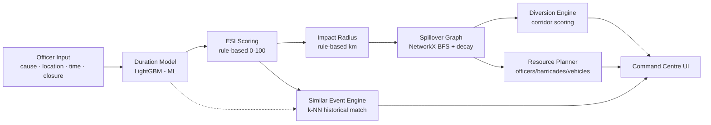
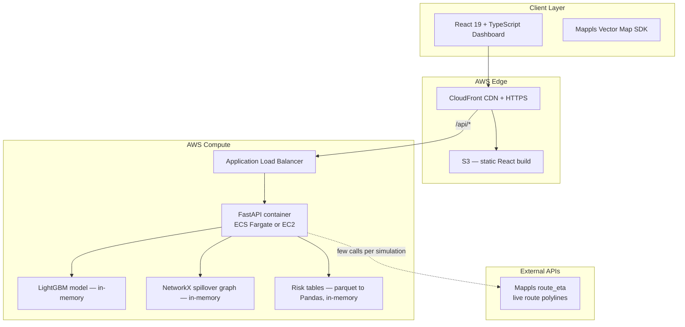
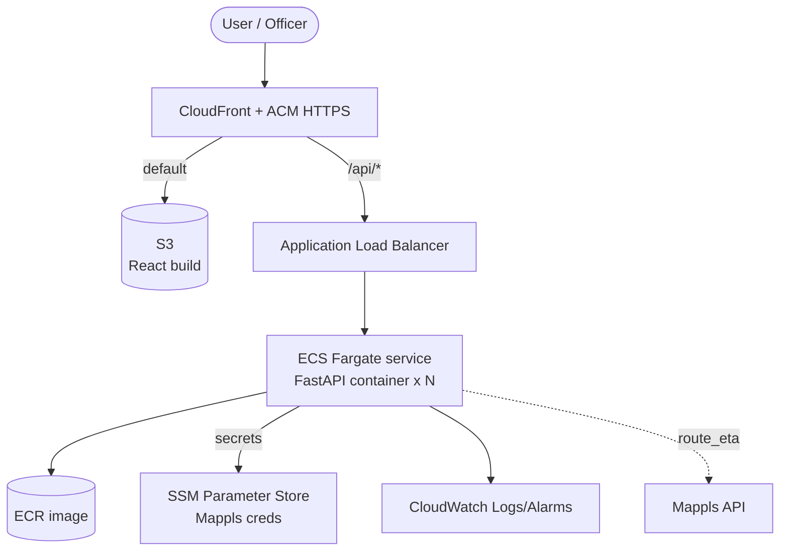

# 🚦 ASTRA — Autonomous Strategic Traffic Response Assistant

**An AI-powered decision-support & emergency-response system for Traffic Police**

*Built for Flipkart Grid 6.0 — Event-Driven Congestion (Planned & Unplanned)*


📄 Full formulas, data audits, and worked examples for every engine live in [`DESIGN_SPEC.md`](DESIGN_SPEC.md) — this README is the judge-facing summary. Deployment runbook in [`docs/DEPLOYMENT.md`](docs/DEPLOYMENT.md).

---

## 30-Second Pitch

> Every traffic event — a breakdown, a procession, a flooded road — is currently handled the same way: an officer looks at it, guesses how bad it is, and deploys resources from memory. **ASTRA replaces the guess.**
>
> Feed it an event (cause, location, time, road-closure status) and in under a second it tells you: how severe it is (0–100 score), how long it will likely last (ML-predicted), how far the congestion will spread (km), exactly which junctions will be hit and how badly, which corridors to divert traffic to, how many officers/barricades/patrol vehicles to deploy and *where*, and — critically — **what happened the last 14 times something like this occurred.** Stack multiple simultaneous events, replay the jam with-vs-without ASTRA, and dispatch an ambulance down a priority green corridor from the nearest of 179 mapped Bengaluru hospitals.
>
> It is a **decision-support system**, not a black box. Every rule-based number is traceable to a formula derived from the dataset. The only machine-learned number is event duration, because it is the only one with a real label to train against.

---

## Table of Contents

1. [Problem Statement](#1-problem-statement)
2. [Solution Overview](#2-solution-overview)
3. [System Architecture](#3-system-architecture)
4. [The Dataset](#4-the-dataset)
5. [Machine Learning Pipeline](#5-machine-learning-pipeline)
6. [Rule-Based Decision Engines](#6-rule-based-decision-engines)
7. [Backend](#7-backend)
8. [Frontend & Command-Centre Tabs](#8-frontend--command-centre-tabs)
9. [Emergency Hospital Network](#9-emergency-hospital-network)
10. [Data Storage](#10-data-storage)
11. [API Reference](#11-api-reference)
12. [Project Structure](#12-project-structure)
13. [Local Setup](#13-local-setup)
14. [AWS Deployment Plan](#14-aws-deployment-plan)
15. [CI/CD](#15-cicd)
16. [Current Implementation Status](#16-current-implementation-status)
17. [Honest Limitations](#17-honest-limitations)
18. [Future Scope](#18-future-scope)
19. [Team](#19-team)

---

## 1. Problem Statement

> "Event impact is not quantified in advance. Resource deployment is experience-driven. There is no post-event learning system."

Bangalore traffic police handle thousands of planned and unplanned events a year — breakdowns, accidents, processions, waterlogging, construction, VIP movements — using nothing but field experience. Three structural gaps drive the design of ASTRA:

| Gap in Current Practice | ASTRA's Answer |
|---|---|
| No way to quantify how bad an event will be before deploying resources | **Event Severity Index (ESI)** — a transparent 0–100 score |
| Resource deployment (officers, barricades, vehicles) is guessed from memory | **Resource Planner** — formula-driven officer/barricade/vehicle counts, per-junction |
| Nothing is learned from past events; every incident starts from zero | **Historical Memory Tables + Similar Event Engine** — every prediction is backed by real past incidents |

---

## 2. Solution Overview

ASTRA ingests a single event description and runs it through six engines in series, returning a complete decision package in **under 1 second**:



**Design principle — ML only where a real label exists.** The dataset has exactly one measurable outcome: `closed_datetime − start_datetime` (event duration). That is the only thing ASTRA predicts with machine learning. Severity, congestion spread, propagation, diversion scoring, and resourcing are **transparent rule-based formulas**, each derived from a measurable pattern in the data and documented with its own justification (see [Section 6](#6-rule-based-decision-engines)). A traffic officer can inspect, question, and override every number — nothing is a black box.

On top of the prediction core, the command centre adds four operational views: **multi-event stacking** (combine simultaneous incidents), a **with-vs-without ASTRA replay**, an interactive **What-If simulator**, and an **emergency dispatch planner** that routes a priority green corridor from the nearest hospital. See [Section 8](#8-frontend--command-centre-tabs).

---

## 3. System Architecture



**Why no database.** The full historical dataset is ~8,000 rows / 45 columns — well under 10 MB. It is loaded once into Pandas DataFrames at process start and held in memory for the lifetime of the backend. The backend is **stateless** apart from one append-only file (`data/feedback.jsonl`, the learning loop). Adding Postgres/Mongo here would add latency, infra cost, and deployment complexity with near-zero benefit at this scale — see [Section 10](#10-data-storage) for what production scale would look like.

---

## 4. The Dataset

8,173 historical traffic incidents from Bangalore, 45 columns. Full data-quality audit, distributions, and cleaning rules live in [`DESIGN_SPEC.md`](DESIGN_SPEC.md) (sections 1–2) — summarized here:

| Fact | Value | Why It Matters |
|---|---|---|
| Total rows | 8,173 | Small enough to live entirely in memory |
| Rows with a valid duration label | ~2,711 (33%) | This is the *only* ML training set |
| `junction` fill rate | 30.7% (294 unique) | Too sparse to be a primary key — coordinates used instead |
| `zone` fill rate | 42.1% (10 unique) | Fallback tier in the risk lookup cascade |
| `corridor` fill rate | 99.8% (~20 unique) | Near-complete — strong categorical feature |
| `event_cause` fill rate | 100% (12 unique) | **Single strongest severity signal** — 40× range in median duration across causes |
| Median physical event span | 13 metres | Confirms "impact radius" must be *modelled*, not read from the data |

The dominance of `event_cause` (vehicle breakdowns resolve in ~0.7h median, potholes persist ~24.8h median — a 40× spread) is the reason it carries the highest weight in both the ESI formula and the duration model's feature importance.

---

## 5. Machine Learning Pipeline

**ASTRA trains exactly one model.** Everything else is deterministic rules (Section 6). This is a deliberate choice, not a shortcut — there is no ground-truth label in the dataset for congestion radius, propagation, or diversion success, so training a model there would mean training against a label we made up ourselves.

### 5.1 Target

```
y = duration_hours = (closed_datetime − start_datetime) in hours
```

Cleaned by dropping negative durations, zero durations, and outliers beyond 168 hours (stale tickets bulk-closed long after resolution) → **2,711 usable rows**.

### 5.2 Features

| Feature | Type | Why |
|---|---|---|
| `event_cause` | categorical (12) | Dominant predictor — 40× range in median duration |
| `corridor` | categorical (~20) | Encodes road width/lane count/diversion options implicitly |
| `requires_road_closure` | binary | Closed roads run 1.45× longer (median) |
| `priority` | binary | Counterintuitively, Low priority → longer duration (slower response) |
| `hour` | int 0–23 | Shift-change and response-time patterns |
| `weekday` | int 0–6 | Weekend response is slower |
| `latitude`, `longitude` | float | Replaces `junction`/`zone` (70%/58% missing) — tree models split on coordinates natively |

**Deliberately excluded:** `junction` name (too sparse), `affected_distance` (near-zero variance, see Section 4), free-text `description` (bilingual NLP out of scope), `status` (leaks the label).

### 5.3 Model

**LightGBM Regressor** — chosen over Linear Regression (relationships are non-linear and interaction-heavy: road-closure × peak-hour compounds multiplicatively) and Random Forest (slower, no native categorical handling). LightGBM handles categoricals and missing values natively and trains in well under a second on 2,700 rows. The pipeline is **risk-aware**: it fits p10/p50/p90 quantiles plus a long-event (>6 h) classifier, so severity uses the planning (p90) duration and confidence uses the p10–p90 band width.

### 5.4 Validation

**80/20 split by time, not random** — the oldest 80% of events train the model, the most recent 20% test it. This mirrors real deployment (predict the future from the past) and avoids leaking future patterns into training.

Measured on the newest-20% time split: **Median AE 0.67 h**, p10–p90 interval hit-rate **79%**, long-event classifier **ROC-AUC 0.87**. Expected feature-importance order (independently confirmed against the hand-built ESI weighting): `event_cause` > `corridor` > `hour` > `latitude` > `longitude` > `road_closure` > `priority` > `weekday`.

---

## 6. Rule-Based Decision Engines

Every engine below is **deterministic and inspectable** — same inputs always produce the same output, and every coefficient has a documented physical justification. Full worked examples are in [`DESIGN_SPEC.md`](DESIGN_SPEC.md) (sections 4, 6–10); summarized here:

| Engine | Formula (summary) | Output |
|---|---|---|
| **Event Severity Index (ESI)** | `0.30·cause + 0.25·duration + 0.20·closure + 0.15·time + 0.10·junction_risk` | 0–100 score → LOW/MEDIUM/HIGH/CRITICAL |
| **Impact Radius** | `min(base(duration) × M_closure × M_peak × M_cause, 10 km)` | how far congestion spreads, in km |
| **Spillover Propagation Graph** | NetworkX BFS from the blocked junction; `congestion_j = congestion_i × e^(−edge_weight/κ)`, κ=2.0, cutoff at 10% | per-junction congestion %, HIGH/MEDIUM/LOW |
| **Similar Event Engine** | weighted k-NN over `cause(0.35) + location(0.25) + closure(0.20) + hour(0.12) + weekday(0.08)` | top-K historical matches + confidence score |
| **Diversion Engine** | 3-layer corridor scoring (load 0.4, reliability 0.3, capacity 0.3) + spillover avoid-list | ranked diversion corridors with confidence % |
| **Resource Planner** | `point_duty + perimeter + site` officers (capped 50); `barricades = site + ⌈radius×4⌉`; `patrol = ⌈area/8⌉` | officer/barricade/patrol counts, per-junction plan |

**Why rules and not ML for these six:** none has a real measured label in the dataset (nobody recorded "how far did the jam spread" or "did the diversion succeed"). A model trained against a self-assigned label is not more trustworthy than a documented formula — just less explainable. Every multiplier (1.8 for closure, 1.6 for peak hour, etc.) is derived from an actual ratio observed in the data, not picked arbitrarily.

---

## 7. Backend

| Layer | Technology | Role |
|---|---|---|
| Web framework | **FastAPI** (Python 3.12) | Async REST API, auto-generated OpenAPI docs at `/docs` |
| Server | Uvicorn (`uvicorn[standard]`) | ASGI server |
| ML | LightGBM, scikit-learn, joblib | Duration model training + inference |
| Graph | NetworkX | Spillover propagation graph (294 nodes) |
| Data | Pandas, NumPy, PyArrow | Risk tables + feature pipelines, parquet, held in memory |
| Geospatial | Haversine (vectorized NumPy) | Free distance maths everywhere except live routing |
| External API | Mappls (MapMyIndia) `route_eta` | Live road route polylines + ETAs (token via OAuth client-credentials) |

**Startup sequence** (everything loads once, into memory, before serving):
1. Load processed parquet (`events_scored`, `junction_risk`, `zone_risk`, `corridor_risk`).
2. Load the trained LightGBM artifact (`artifacts/duration_model.joblib`).
3. Load the prebuilt NetworkX spillover graph (`spillover_graph.pkl`).

A live `POST /api/predict` touches none of these I/O paths — everything is resident, so the full six-engine pipeline runs in ~15 ms after a ~0.4 s startup load.

> **Mappls note for this account:** only `route_eta` is licensed (not `route_adv`/`route_traffic`), and forward geocoding returns place-codes without coordinates — so hospital coordinates were sourced offline (see [Section 9](#9-emergency-hospital-network)). Map overlays are removed with `mappls.remove({ map, layer })`, not the object's `.remove()`.

---

## 8. Frontend & Command-Centre Tabs

| Layer | Technology | Role |
|---|---|---|
| Framework | **React 19 + TypeScript** (strict) | Shared `EventInput` → `Prediction` contract with the backend (`types.ts`) |
| Build tool | **Vite 8** | Dev server (`:5173`, proxies `/api` → `:8001`) + production bundle |
| Styling | **Tailwind CSS v4** (`@tailwindcss/vite`) | Dark/light command-centre theme with CSS variables |
| Maps | **Mappls Web Maps SDK** (vector v3.0) | Live road maps, route polylines, circle/marker overlays; SVG schematic fallback when unconfigured |
| HTTP | Axios | REST calls to `/api/*` |
| State | React `useState`/`useMemo` | Tab + simulation state in `App.tsx` (no external store) |

The dashboard is a single-page command centre with **six tabs**:

1. **Simulator** — the core screen. Configure an event (cause, junction, time, day, closure, priority) and run the six-engine pipeline. The left panel is a stacking **Event Simulator**: each run is committed as a card, and **"+ Add another event"** lets you layer simultaneous incidents — affected junctions are unioned, ESI escalates, resources sum, and every epicentre is drawn on the map. Right panel: severity gauge, why-panel, resource plan, diversions, spillover timeline, similar events, feedback.

2. **ASTRA Impact** — a side-by-side **with-vs-without** replay of the same incident, driven by the timeline scrubber. Both maps animate the jam spreading; on the "With ASTRA" side, a **green diversion corridor lights up at the junction currently being cleared and moves on as each junction's severity drops** (one corridor at a time, synced to the colours), illustrating how diversions dissipate the jam. All escape routes are **pre-fetched and cached the moment the simulation runs** (`routeCache.ts`), so playback is instant and ends with the timeline — it never loops. Headline deltas: delay, vehicles, fuel, time lost, economic loss.

3. **Interventions** — a ranked **recommended action set** (the highest-leverage diversions/closures/holds) with the vehicles each would relieve.

4. **What-If** — an interactive projection that scales the live prediction by eight conditions (severity, lanes, capacity, weather, time-of-day, day, volume, response). It is **data-driven**: junction colours come from the real spillover congestion × a normalized scenario load (×1.00 at defaults), so it reflects the data instead of skewing everything to "critical". Features: **click any junction for a drill-down** (projected risk band, congestion %, spillover ETA), a colour legend, a glow gradient, and an **"Animate spread"** reveal that lights junctions outward over time.

5. **Emergency** — priority dispatch (see [Section 9](#9-emergency-hospital-network)): for **each incident** (so stacked multi-event simulations get a dispatch each), it picks the **nearest of 179 Bengaluru hospitals**, draws a **priority green corridor** from that hospital to the incident, places **officer markers at the signals held green** along the route, and shows the **dispatched officers/barricades on the hospital placemarker** (the same SVG icons as the simulator's resource panel — no emojis). Aggregate metrics: incidents, total distance, worst priority ETA, total time saved, officers·signals.

6. **Overview** — fleet-wide KPIs, risk distribution, and the top risk junctions across the city.

---

## 9. Emergency Hospital Network

The Emergency tab dispatches from real hospitals, not an approximate offset point.

- **179 Bengaluru hospitals** across 6 regions (Central / North / South / East / West / South-East) are stored in [`frontend/src/hospitalsData.ts`](frontend/src/hospitalsData.ts) with coordinates.
- Coordinates were geocoded offline (Mappls geocoding on this account returns only place-codes, no lat/lng) via three passes — [`geocode_hospitals.py`](scripts/geocode_hospitals.py) → [`..._pass2.py`](scripts/geocode_hospitals_pass2.py) → [`..._pass3.py`](scripts/geocode_hospitals_pass3.py) — using **OpenStreetMap Nominatim + Photon** with Bangalore-bounds and per-region sanity checks, curated aliases for tricky names, and a deterministic region-centroid fallback for the rest.
- **174 of 179 have exact coordinates**; the remaining 5 are anchored within their correct region. Every hospital is at least in the right part of the city, so "nearest to the incident" is always sensible.
- At runtime the tab computes the nearest hospital **per incident** (haversine) — so a stacked multi-event simulation gets a hospital + corridor each — and shows it as a placemarker with the cross/officer/barricade SVG icons + distance, dispatching officers to the cleared corridor signals.

To regenerate the dataset (one-off, polite rate-limited, ~5–10 min):

```bash
python scripts/geocode_hospitals.py        # pass 1: Nominatim + region fallback
python scripts/geocode_hospitals_pass2.py  # pass 2: Photon/Nominatim lift for the fallbacks
python scripts/geocode_hospitals_pass3.py  # pass 3: curated aliases + relaxed match for the long tail
```

---

## 10. Data Storage

**No database is used.** Historical data, risk tables, the trained model, and the spillover graph are loaded into memory at startup (parquet + joblib + pickle, regenerated by `scripts/build_all.py`). The only mutable state is the append-only **`data/feedback.jsonl`** (the learning loop).

| File | Role | Refresh |
|---|---|---|
| `data/raw/astra_events.csv` | raw historical incidents (8,173 rows) | static, ships with the repo |
| `data/processed/events_scored.parquet` | cleaned + ESI-scored events | `scripts/03_compute_esi.py` |
| `data/processed/junction_risk.parquet` | per-junction risk score (Bayesian shrinkage) | `scripts/02_build_memory.py` |
| `data/processed/zone_risk.parquet`, `corridor_risk.parquet` | fallback + diversion risk tables | `scripts/02_build_memory.py` |
| `data/processed/spillover_graph.pkl` | prebuilt NetworkX graph (294 nodes) | `scripts/05_build_graph.py` |
| `artifacts/duration_model.joblib` | trained LightGBM model | `scripts/04_train_duration.py` |
| `data/feedback.jsonl` | post-event feedback (the learning loop) | written live by `/api/feedback` |

**The Learning Loop:** every resolved event recorded via `/api/feedback` does two things. (1) It calibrates future duration predictions for that junction/cause (the lightweight `feedback.jsonl` shrinkage layer). (2) The officer's free-text note is **deciphered by Gemini** (`notes_ai.structure_event`) into a structured row matching the raw dataset schema — cause, road-closure, vehicle, priority, description, duration — enriched with the junction's coordinates/zone, **appended to `data/raw/astra_events.csv`** (`astra/ingest.py`), and the **full pipeline is re-run in a background thread** (`build_all.py`) so the model, risk tables, ESI scores, and spillover graph retrain on the new event before the API hot-reloads its state. Poll `/api/pipeline/status`; set `ASTRA_RETRAIN_ON_FEEDBACK=0` to ingest without retraining.

*At production scale the natural next step is Postgres for the event log and a shared store for `feedback.jsonl` (DynamoDB / S3 / EFS) so multiple backend instances stay consistent — not because Pandas-in-memory breaks, but because horizontal scaling needs a shared source of truth.*

---

## 11. API Reference

Base path `/api`. Full request/response schemas are Pydantic models exposed at `/docs` (Swagger UI).

| Endpoint | Method | Purpose |
|---|---|---|
| `/api/health` | GET | Health check (ALB / ECS target-group probe) |
| `/api/predict` | POST | Main prediction — `EventInput` → full six-engine `Prediction` |
| `/api/feedback` | POST | Record a resolved event (drives the learning loop) |
| `/api/feedback/summary` | GET | Aggregate feedback stats |
| `/api/pipeline/status` | GET | Whether a feedback-triggered retrain is in progress |
| `/api/junctions` | GET | All 294 junctions with coordinates + risk scores |
| `/api/corridors` | GET | Corridors with historical risk metrics |
| `/api/events` | GET | Recent scored events (heatmap points) |
| `/api/stats/overview` | GET | KPI numbers for the Overview tab |
| `/api/mappls/status` | GET | Whether Mappls credentials are configured |
| `/api/mappls/token` | GET | Mappls access token (for loading the map SDK) |
| `/api/mappls/directions` | POST | Road route + polyline between two points (`route_eta`) |
| `/api/mappls/matrix` | POST | Road distance matrix |

**Core contract** (`frontend/src/types.ts` ↔ `astra/api/schemas.py`):

```typescript
interface EventInput {
  event_cause: string;            // one of 12 causes
  junction?: string | null;
  zone?: string | null;
  hour: number;                   // 0–23
  weekday: number;                // 0–6
  road_closure: boolean;
  priority_high: boolean;
  duration_override?: number | null;
}

interface Prediction {
  esi: number;                    // 0–100
  risk_level: 'LOW' | 'MEDIUM' | 'HIGH' | 'CRITICAL';
  duration_hours: number;
  impact_radius_km: number;
  confidence: number;
  affected_junctions: AffectedJunction[];
  resources: Resources;
  diversions: { recommended: DiversionCorridor[]; /* … */ };
  similar: { matches: SimilarMatch[]; /* … */ };
}
```

---

## 12. Project Structure

```
Flipkart_gridlock_2.0/
├── astra/                           # Python package — all backend logic
│   ├── config.py                    # single source of truth for every constant
│   ├── geo.py                       # vectorized Haversine
│   ├── pipeline.py                  # AstraPipeline — runs every engine for one event
│   ├── data/                        # load.py · clean.py · features.py
│   ├── memory/                      # risk_tables.py · lookup.py · feedback.py
│   ├── scoring/esi.py               # Event Severity Index
│   ├── models/duration_model.py     # LightGBM duration model (the only ML)
│   ├── engines/                     # impact_radius · spillover · similar_events · diversion · resource_planner
│   ├── integrations/mappls.py       # Mappls token + route_eta + matrix
│   ├── integrations/notes_ai.py     # Gemini — extract insights + structure_event
│   ├── ingest.py                    # feedback → dataset row → append → background retrain
│   └── api/                         # main.py (FastAPI) · schemas.py (pydantic)
├── scripts/
│   ├── 01_preprocess … 05_build_graph.py · build_all.py
│   └── geocode_hospitals.py · geocode_hospitals_pass2.py   # hospital coordinates
├── data/
│   ├── raw/astra_events.csv         # the dataset (committed)
│   ├── processed/  interim/         # regenerated by build_all.py (gitignored)
│   └── feedback.jsonl               # learning-loop state (gitignored)
├── artifacts/                       # trained model + metrics (gitignored)
├── tests/                           # pytest — one suite per engine
├── frontend/                        # React 19 + TypeScript + Vite 8 + Tailwind v4
│   ├── src/{App.tsx,api.ts,types.ts,mapsdk.ts,combine.ts,routeCache.ts,hospitalsData.ts}
│   └── src/components/
│       ├── EventForm · PredictionPanel · WhyPanel · ResourcePanel · DiversionPanel
│       ├── SpilloverTimeline · SimilarPanel · FeedbackForm · MapView · Overview · icons
│       └── CompareView · InterventionView · WhatIfView · EmergencyView
├── Dockerfile · frontend/Dockerfile · frontend/nginx.conf · docker-compose.yml
├── DESIGN_SPEC.md · docs/DEPLOYMENT.md · README.md
```

---

## 13. Local Setup

### Prerequisites
- Python 3.12+ · Node.js 20+
- (Optional) Mappls credentials for the live vector map + routing — everything else runs without them (SVG fallback).

### Backend
```bash
pip install -r requirements.txt
python scripts/build_all.py                     # one-time: builds data/processed + artifacts
uvicorn astra.api.main:app --reload --port 8001 # dev port — matches the Vite proxy
```
Verify: `http://localhost:8001/docs` (Swagger) and `http://localhost:8001/api/health` → `{"status":"ok"}`.

### Frontend
```bash
cd frontend
npm install
npm run dev                                      # http://localhost:5173, proxies /api → :8001
```

### Mappls (optional)
```bash
cp .env.example .env     # set MAPMYINDIA_CLIENT_ID / MAPMYINDIA_CLIENT_SECRET
```

### Tests
```bash
python -m pytest -q
```

### Docker (single host)
```bash
docker compose up --build      # backend :8000, frontend :8080 (nginx proxies /api → backend:8000)
```

> The Docker backend serves on **:8000** (baked image runs `build_all.py` at build time); local dev uses **:8001** to match `vite.config.ts`.

---

## 14. AWS Deployment Plan

ASTRA splits cleanly into a **static SPA** and a **stateless containerized API**, which maps directly onto a standard, low-cost AWS topology. Two paths below: a 30-minute demo path and a production path.



### 14.1 Component plan

| Layer | Service | Choice & why |
|---|---|---|
| Static frontend | **S3 + CloudFront** | `frontend/dist` is pure static assets; CloudFront gives one HTTPS domain that serves the SPA *and* proxies `/api/*` to the backend, so the app keeps calling relative `/api` with no code change. Origin Access Control keeps the bucket private. |
| TLS | **ACM** | Free certificate on the CloudFront distribution (must be in `us-east-1`). |
| Backend image | **ECR** | Private registry for the `Dockerfile` image (`python:3.12-slim`, `build_all.py` baked in, serves `:8000`). |
| Backend runtime | **ECS Fargate** (recommended) *or* **EC2** | Fargate = no servers to patch, scales on CPU, health-checked by the ALB. The API is **stateless** (model/graph/tables in memory), so it scales horizontally cleanly. EC2 + `docker compose` is the cheaper/simpler alternative for a demo. |
| Routing / LB | **ALB** | Path-routes `/api/*` to the Fargate tasks, health-check `/api/health`. |
| Secrets | **SSM Parameter Store** (SecureString) | `MAPMYINDIA_CLIENT_ID/SECRET` injected as container env via the task definition — never baked into the image. |
| Observability | **CloudWatch** | Container logs + an alarm on 5xx / unhealthy hosts. |
| Shared state (optional) | **EFS or DynamoDB** | Only needed if you run >1 task and want a shared `feedback.jsonl` (see [Section 10](#10-data-storage)). Not required for the demo. |

### 14.2 Fast path — single EC2 (demo, ~30 min)

One `t3.medium` (2 vCPU / 4 GB) runs both containers via compose.

```bash
# Amazon Linux 2023 / Ubuntu 22.04
sudo yum install -y docker git            # or: apt install
sudo systemctl enable --now docker
sudo curl -SL https://github.com/docker/compose/releases/latest/download/docker-compose-linux-x86_64 \
  -o /usr/local/bin/docker-compose && sudo chmod +x /usr/local/bin/docker-compose

git clone <repo-url> && cd Flipkart_gridlock_2.0
printf 'MAPMYINDIA_CLIENT_ID=...\nMAPMYINDIA_CLIENT_SECRET=...\n' > .env   # optional
docker compose up --build -d              # frontend :8080, backend :8000
```
Open security-group port **8080** (and 22 for SSH from your IP). Dashboard: `http://<ec2-public-ip>:8080`. Put it behind an ALB + ACM cert for HTTPS when ready.

### 14.3 Production path — S3/CloudFront + ECR/Fargate/ALB

**1 — Frontend → S3 + CloudFront**
```bash
cd frontend && npm ci && npm run build
aws s3 mb s3://astra-frontend-<acct>
aws s3 sync dist/ s3://astra-frontend-<acct>/ --delete
# CloudFront: Origin A = S3 (OAC, default behaviour, SPA error mapping 403/404 → /index.html)
#             Origin B = ALB (behaviour path `/api/*`, forward all headers, no caching)
# Attach an ACM cert (us-east-1) + your domain.
```

**2 — Backend image → ECR**
```bash
aws ecr create-repository --repository-name astra-backend
aws ecr get-login-password | docker login --username AWS --password-stdin <acct>.dkr.ecr.<region>.amazonaws.com
docker build -t astra-backend .
docker tag astra-backend:latest <acct>.dkr.ecr.<region>.amazonaws.com/astra-backend:latest
docker push <acct>.dkr.ecr.<region>.amazonaws.com/astra-backend:latest
```

**3 — Secrets → SSM**
```bash
aws ssm put-parameter --name /astra/MAPMYINDIA_CLIENT_ID     --type SecureString --value '...'
aws ssm put-parameter --name /astra/MAPMYINDIA_CLIENT_SECRET --type SecureString --value '...'
```

**4 — ECS Fargate service**
- Task definition: container = the ECR image, port **8000**, 0.5 vCPU / 1 GB (the in-memory model+graph+tables are ~150 MB), `secrets` pulling the two SSM parameters into env, log driver `awslogs`.
- Service: desired count 1–2 behind the ALB target group (port 8000, health check `/api/health`, healthy threshold 2). Enable CPU target-tracking autoscaling (e.g. 60%).

**5 — Wire it up & verify**
- ALB listener `/api/*` → the Fargate target group; CloudFront `/api/*` behaviour → the ALB.
- Open the CloudFront domain, run an event in the Simulator, confirm a `Prediction` returns and the Emergency map routes.

### 14.4 Statelessness & scaling notes
- The API holds no per-request state — any task can serve any request, so scaling out is just raising the desired count.
- The one caveat is `data/feedback.jsonl`. For a single task it's fine on the container's ephemeral disk (lost on redeploy). For multiple tasks or durable feedback, mount **EFS** at `data/` or move feedback to **DynamoDB/S3** (small adapter in `astra/memory/feedback.py`).
- Hospital data and the trained model ship **inside the image** — no runtime geocoding or external data dependency on the hot path.

### 14.5 Security checklist
- S3 bucket private; served only via CloudFront **OAC**. ACM/TLS on CloudFront; HTTP→HTTPS redirect.
- ALB security group allows only CloudFront; ECS tasks allow only the ALB on 8000.
- Mappls creds in **SSM SecureString**, never in the image or git (`.env` is gitignored; rotate if ever committed).
- Least-privilege task role (ECR pull, SSM get, CloudWatch logs).

### 14.6 Cost estimate

| Scenario | Services | Approx |
|---|---|---|
| **Demo, 1 week** (single EC2) | t3.medium + S3 + CloudFront | **~$3–4** |
| **Production, 1 month** (low traffic) | Fargate 1×0.5vCPU (~$15) + ALB (~$16) + S3/CloudFront (~$1) | **~$32/mo** |

---

## 15. CI/CD

A two-lane GitHub Actions pipeline (suggested `.github/workflows`):

**Backend lane** — on push to `main` touching `astra/**`, `scripts/**`, `requirements.txt`, `Dockerfile`:
1. `pip install -r requirements.txt && python -m pytest -q`
2. `docker build` → push to ECR (tag = git SHA)
3. `aws ecs update-service --force-new-deployment` (rolling deploy, ALB drains old tasks)

**Frontend lane** — on push touching `frontend/**`:
1. `npm ci && npx tsc --noEmit && npm run build`
2. `aws s3 sync dist/ s3://astra-frontend-<acct>/ --delete`
3. `aws cloudfront create-invalidation --paths "/*"`

Gate deploys on `pytest` (backend) and `tsc --noEmit` (frontend) so a red build never ships.

---

## 16. Current Implementation Status

The full system is **implemented and runnable end-to-end**, built phase by phase (see git log). Every engine has unit tests and the pipeline is verified over live HTTP.

| Layer | Status |
|---|---|
| Data preprocessing + feature engineering | ✅ `astra/data/` · `scripts/01_preprocess.py` |
| Junction / zone / corridor risk tables (Bayesian shrinkage) | ✅ `astra/memory/` · `scripts/02_build_memory.py` |
| ESI scoring (5-component, cascade fallback) | ✅ `astra/scoring/esi.py` |
| Duration model (LightGBM p10/p50/p90 + long-event classifier) | ✅ `astra/models/` · `scripts/04_train_duration.py` |
| Impact radius · Spillover graph · Similar events · Diversion · Resource planner | ✅ `astra/engines/` |
| Pipeline orchestration + FastAPI backend + learning loop | ✅ `astra/pipeline.py` · `astra/api/` |
| Mappls integration (token / route_eta / matrix) | ✅ `astra/integrations/mappls.py` |
| React 19 dashboard — 6 tabs | ✅ `frontend/` |
| Multi-event stacking (Simulator) | ✅ `App.tsx` · `combine.ts` · `EventForm.tsx` |
| With-vs-without replay + sequential green corridors (ASTRA Impact) | ✅ `CompareView.tsx` |
| What-If: data-driven projection + per-junction drill-down + animated spread | ✅ `WhatIfView.tsx` |
| Emergency dispatch (per-incident) + 179-hospital network (174 exact), general-hospital preference | ✅ `EmergencyView.tsx` · `hospitalsData.ts` · `scripts/geocode_hospitals*.py` |
| Feedback → Gemini-structured dataset row → append → background retrain | ✅ `astra/ingest.py` · `notes_ai.structure_event` · `/api/feedback` |
| Docker + AWS deployment | ✅ `Dockerfile` · `docker-compose.yml` · `docs/DEPLOYMENT.md` |

**Measured performance:** Median AE 0.67 h, p10–p90 hit-rate 79%, long-event ROC-AUC 0.87; full pipeline ~15 ms/event after ~0.4 s startup.

---

## 17. Honest Limitations

| ASTRA Can | ASTRA Cannot |
|---|---|
| Predict event duration from historical patterns (ML, with measured MAE) | Predict real-time traffic volume — there is no live sensor feed |
| Estimate congestion spread via a documented, inspectable formula | Give turn-by-turn navigation — only junction-level corridor recommendations |
| Identify at-risk junctions via road-network propagation, not a circle | Guarantee a diversion corridor stays clear — new events can appear anytime |
| Quantify resource needs per junction and dispatch from the nearest hospital | Account for exact lane-level road capacity — not in the dataset |
| Route a priority green corridor with real hospital coordinates | Pinpoint all 179 hospitals — 5 are region-anchored, not exact |
| Learn from every resolved event via the feedback loop | Replace an officer's judgement — the officer always has final say |

---

## 18. Future Scope

- Live sensor/GPS feed to replace static heatmaps with real-time congestion.
- Postgres event log + shared feedback store once multiple backend instances need consistency ([Section 10](#10-data-storage)).
- Lift the remaining 5 region-anchored hospitals to exact coordinates (paid geocoder / manual curation).
- Mobile-first companion view for field officers.
- Continuous automated retraining of the duration model as resolved events accumulate.
- Per-city recalibration — the formulas are tuned to Bangalore's patterns.

---

## 19. Team

*Built for Flipkart Grid 6.0 — Event-Driven Congestion (Planned & Unplanned) track.*

| Member | |
|---|---|
| **Puneet** | Team member |
| **Monalisha** | Team member |

---

*ASTRA is a decision-support tool, not a decision-making tool. The officer always has the final word — our job is to make sure that word is informed by data, not just memory.*
